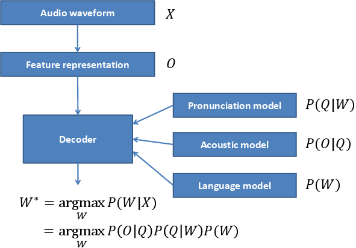

.. py:currentmodule:: bob.kaldi

.. testsetup:: *

   from __future__ import print_function
   import pkg_resources
   import bob.kaldi
   import bob.io.audio
   import tempfile
   import numpy

================================
 Voice Activity Detection (VAD)
================================

Energy-based
------------

A simple energy-based VAD is implemented in :py:func:`bob.kaldi.compute_vad`.
The function expects the speech samples as :obj:`numpy.ndarray` and the sampling
rate as :obj:`float`, and returns an array of VAD labels :obj:`numpy.ndarray`
with the labels of 0 (zero) or 1 (one) per speech frame:

.. doctest::

   >>> sample = pkg_resources.resource_filename('bob.kaldi', 'test/data/sample16k.wav')
   >>> data = bob.io.audio.reader(sample)
   >>> VAD_labels = bob.kaldi.compute_vad(data.load()[0], data.rate)
   >>> print (len(VAD_labels))
   317

DNN-based
---------

A Deep Neural Network (DNN), frame-based, VAD is implemented in
:py:func:`bob.kaldi.compute_dnn_vad`. Pre-trained DNN on AMI_ database
with headset microphone recordings is used for forward pass of mfcc
features. The VAD decision is computed by comparing the silence
posterior feature with the silence threshold.

.. doctest::

   >>> DNN_VAD_labels = bob.kaldi.compute_dnn_vad(data.load()[0], data.rate)
   >>> print (len(DNN_VAD_labels))
   317

================================
 Speaker recognition evaluation
================================

MFCC Extraction
---------------

Two functions are implemented to extract MFCC features
:py:func:`bob.kaldi.mfcc` and :py:func:`bob.kaldi.mfcc_from_path`. The former
function accepts the speech samples as :obj:`numpy.ndarray`, whereas the latter
the filename as :obj:`str`:

1. :py:func:`bob.kaldi.mfcc`

   .. doctest::

      >>> feat = bob.kaldi.mfcc(data.load()[0], data.rate, normalization=False)
      >>> print (feat.shape)
      (317, 39)

2. :py:func:`bob.kaldi.mfcc_from_path`

   .. doctest::

      >>> feat = bob.kaldi.mfcc_from_path(sample)
      >>> print (feat.shape)
      (317, 39)

UBM training and evaluation
---------------------------

Both diagonal and full covariance Universal Background Models (UBMs)
are supported, speakers can be enrolled and scored:

.. doctest::

  >>> # Train small diagonall GMM
  >>> diag_gmm_file = tempfile.NamedTemporaryFile()
  >>> full_gmm_file = tempfile.NamedTemporaryFile()
  >>> dubm = bob.kaldi.ubm_train(feat, diag_gmm_file.name, num_gauss=2, num_gselect=2, num_iters=2)
  >>> # Train small full GMM
  >>> ubm = bob.kaldi.ubm_full_train(feat, dubm, full_gmm_file.name, num_gselect=2, num_iters=2)
  >>> # Enrollement - MAP adaptation of the UBM-GMM
  >>> spk_model = bob.kaldi.ubm_enroll(feat, dubm)
  >>> # GMM scoring
  >>> score = bob.kaldi.gmm_score(feat, spk_model, dubm)
  >>> print ('%.3f' % score)
  0.282

iVector + PLDA training and evaluation
--------------------------------------

The implementation is based on Kaldi recipe SRE10_. It includes
ivector extrator training from full-diagonal GMMs, PLDA model
training, and PLDA scoring.

.. doctest::

  >>> plda_file = tempfile.NamedTemporaryFile()
  >>> mean_file = tempfile.NamedTemporaryFile()
  >>> spk_file = tempfile.NamedTemporaryFile()
  >>> test_file = pkg_resources.resource_filename('bob.kaldi', 'test/data/test-mobio.ivector')
  >>> features = pkg_resources.resource_filename('bob.kaldi', 'test/data/feats-mobio.npy')
  >>> train_feats = numpy.load(features)
  >>> test_feats = numpy.loadtxt(test_file)
  >>> # Train PLDA model; plda[0] - PLDA model, plda[1] - global mean
  >>> plda = bob.kaldi.plda_train(train_feats, plda_file.name, mean_file.name)
  >>> # Speaker enrollment (calculate average iVectors for the first speaker)
  >>> enrolled = bob.kaldi.plda_enroll(train_feats[0], plda[1])
  >>> # Calculate PLDA score
  >>> score = bob.kaldi.plda_score(test_feats, enrolled, plda[0], plda[1])
  >>> print ('%.4f' % score)
  -23.9922

======================
 Deep Neural Networks
======================

Forward pass
------------

A forward-pass with pre-trained DNN is implemented in
:py:func:`bob.kaldi.nnet_forward`. Output posterior features are
returned as :obj:`numpy.ndarray`. First output features of each row (a
processed speech frame) contain posteriors of silence, laughter
and noise, indexed 0, 1 and 2, respectively. These posteriors are thus
used for silence detection in :py:func:`bob.kaldi.compute_dnn_vad`,
but might be used also for the laughter and noise detection as well.

.. doctest::	     
	     
    >>> nnetfile   = pkg_resources.resource_filename('bob.kaldi', 'test/dnn/ami.nnet.txt')
    >>> transfile = pkg_resources.resource_filename('bob.kaldi', 'test/dnn/ami.feature_transform.txt')
    >>> feats = bob.kaldi.cepstral(data.load()[0], 'mfcc', data.rate, normalization=False)
    >>> nnetf = open(nnetfile)
    >>> trnf = open(transfile)
    >>> dnn = nnetf.read()
    >>> trn = trnf.read()
    >>> nnetf.close()
    >>> trnf.close()
    >>> ours = bob.kaldi.nnet_forward(feats, dnn, trn)
    >>> print (ours.shape)
    (317, 43)

===================
Speech recognition
===================

Speech recognition is a processes that generates a text transcript
given speech audio. Most of current Automatic Speech Recognition 
(ASR) systems use the following pipeline: 

The ASR system has to be first trained. More specifically, its key
statistical models:

* Pronunciation model, the lexicon, that associates written and spoken
  form of words. The lexicon contains words :math:`W` and defines them
  as sequences of phonemes (the speech sounds) :math:`Q`.
* Acoustic model, GMMs or DNNs, that associates the speech features
  :math:`O` and the spoken words :math:`Q`.
* Language model, usually n-gram model, that captures most probably
  sequences of :math:`W` of a particular language.

The transcript of the input audio waveform :math:`X` is then generated
by transformation of :math:`X` to features :math:`O` (for example
ceptral features computed by :py:func:`bob.kaldi.cepstral`), and an
ASR decoder that outputs the most probable transcript :math:`W^*`
using the pre-trained statistical models.

Acoustic models
---------------

The basic acoustic model is called monophone model, where :math:`Q`
consists just of the phonemes, and consider them contextually
independent. The training of such model has following pipeline:

* Model initialization for a given Hidden Markov Model (HMM)
  structure, usually 3-state left-to-right model.
* Compiling training graphs that compiles Finite State Transducers
  (FSTs), one for each train utterance. This requires the lexicon, and
  the word transcription of the training data.
* First alignment and update stage that produces a transition-model
  and GMM objects for equally spaced alignments.
* Iterative alignment and update stage.

  
.. doctest::     

    >>> fstfile   = pkg_resources.resource_filename('bob.kaldi', 'test/hmm/L.fst')
    >>> topofile = pkg_resources.resource_filename('bob.kaldi', 'test/hmm/topo.txt')
    >>> phfile = pkg_resources.resource_filename('bob.kaldi', 'test/hmm/sets.txt')
    >>> # word labels
    >>> uttid='test'
    >>> labels = uttid + ' 27312 27312 27312'
    >>> train_set={}
    >>> train_set[uttid]=feats
    >>> topof = open(topofile)
    >>> topo = topof.read()
    >>> topof.close()
    >>> model = bob.kaldi.train_mono(train_set, labels, fstfile, topo, phfile , numgauss=2, num_iters=2)
    >>> print (model.find('TransitionModel'))
    1 
   
.. include:: links.rst
    
